# 基于深度学习的宫颈细胞在线分类识别系统V1.0

# 单样本识别界面

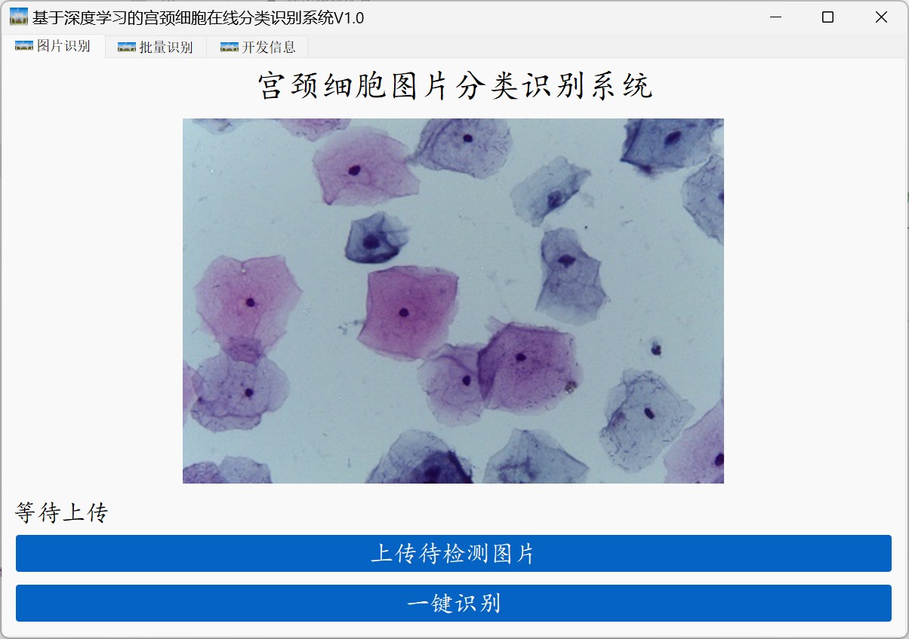

# 批量识别界面

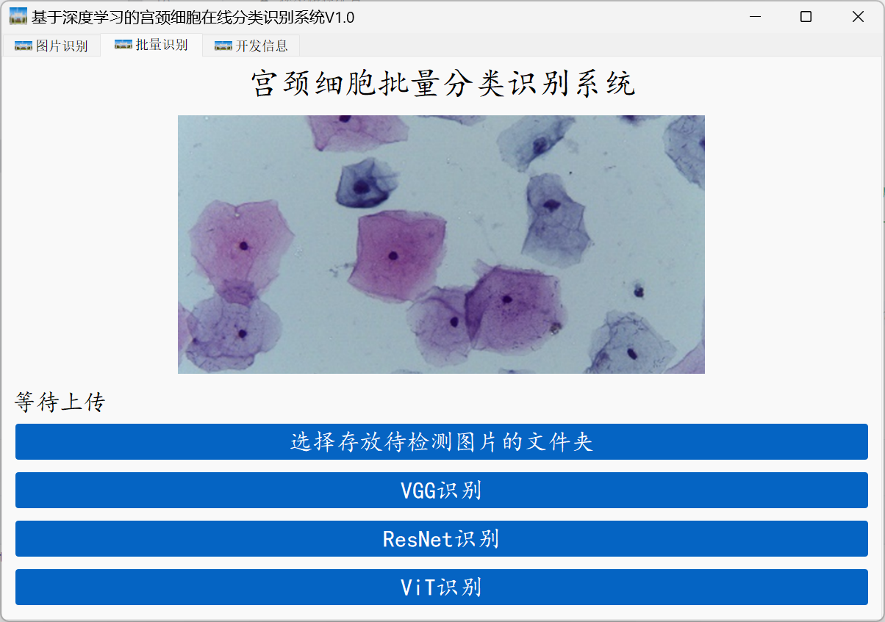

# 单样本识别功能展示

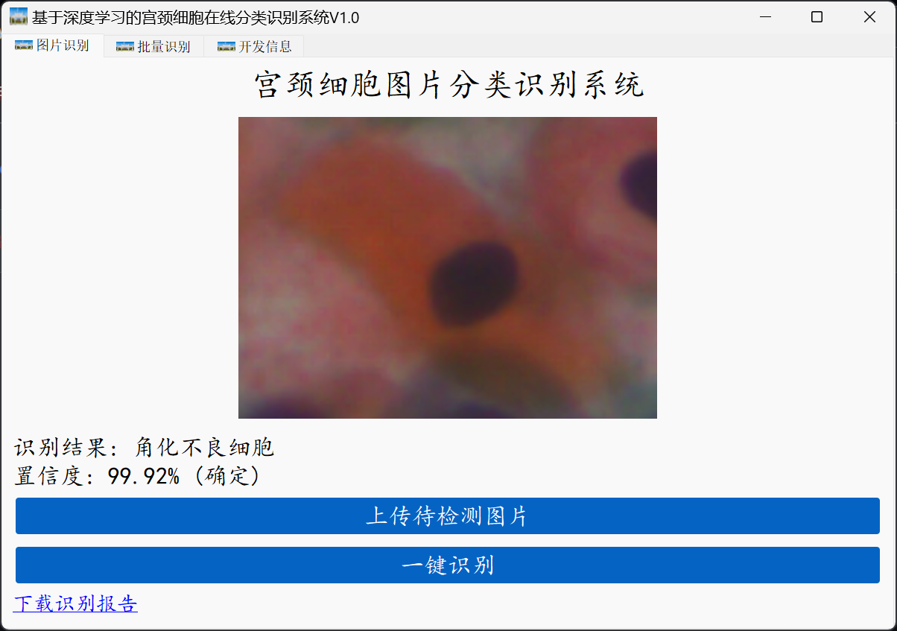

# 批量识别功能展示

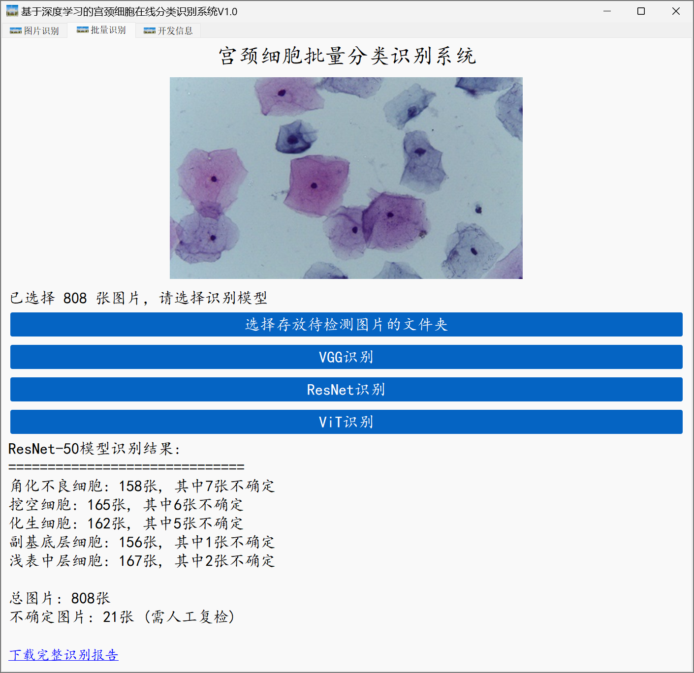

# 单样本识别报告

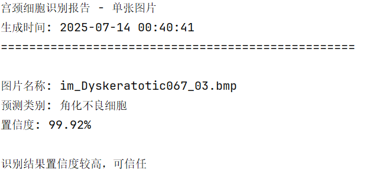

# 多样本识别报告

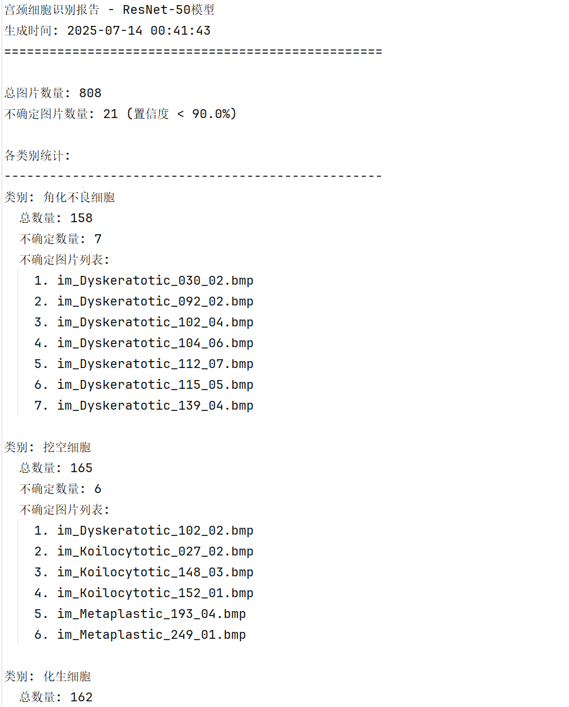

# 功能演示视频

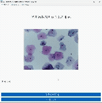

# 数据集介绍

本项目使用的宫颈细胞数据集是SIPaKMeD数据集，该数据集是在2018年第25届IEEE图像处理国际会议上公开的一个权威数据集，一共包含了4049张带标签的宫颈单细胞图像，这些图像是病理专家从966张带有宫颈细胞簇的巴氏涂片图像中人工裁剪得到的。该数据集根据宫颈细胞外观与形态的不同分成五个类别，即：浅表中层细胞、副基底层细胞、挖空细胞、角化不良细胞和化生细胞。根据细胞病变的程度又分为正常细胞、良性细胞（正常细胞转变为恶性细胞的过渡状态）和异常细胞。SIPaKMeD数据集的具体类别情况可见下表，图1展示了五类细胞的图像。

表1 SIPaKMeD数据集类别情况

| **细胞分类** | **细胞名称** |       数量（张）       |
| :--------------------: | :--------------------: |:-----------------:|
|        正常细胞        |      浅表中层细胞      |        831        |
|                        |      副基底层细胞      |        787        |
|        异常细胞        |        挖空细胞        |        825        |
|                        |      角化不良细胞      |        813        |
|        良性细胞        |        化生细胞        |        793        |
|          合计          |                        |       4049        |

  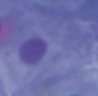  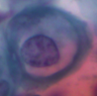 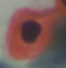 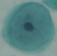

a) 浅表中层细胞  b) 副基底层细胞   c) 挖空细胞  d) 角化不良细胞  e) 化生细胞

图1 SIPaKMeD数据集各类别细胞图像
